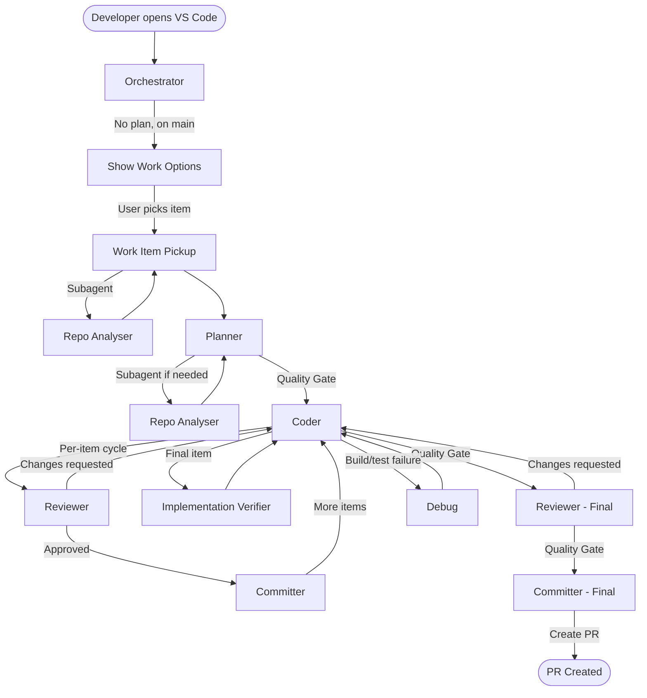

# Workflow Walkthrough

A narrative walkthrough of the complete agent workflow, using a concrete scenario. Each phase shows what the developer sees, what the agent does behind the scenes, and how handoffs work.

## Flow Diagram



## Scenario Setup

We'll follow a single PBI through the entire pipeline:

> **#4521 — Add payment validation**
>
> _Validate that payment requests have a positive amount, a valid account ID, and sufficient balance before processing. Return structured validation errors._
>
> **Acceptance Criteria:**
> - Payments with zero or negative amounts are rejected
> - Payments referencing a non-existent account are rejected
> - Payments exceeding account balance are rejected
> - Each rejection returns a specific error code
> - All validations run before any side effects

The repository is a .NET 8 payments API using MediatR.

---

## Happy Path Walkthrough

### Phase 1: Orchestrator (Entry Point)

**What the developer does:** Opens VS Code on the `main` branch and invokes the Orchestrator agent.

**What the agent does:**

1. **Gathers state** (in parallel):
   - Reads `.planning/PLAN.md` — file not found
   - Reads `.planning/SPIKE-FINDINGS.md` — file not found
   - Runs `git branch --show-current` — returns `main`
   - Runs `git status --porcelain` — empty (clean)

2. **Routes based on state:** Matches rule 8 — no PLAN.md, on `main`.

3. **Quick retrospective check:** Runs `git log --oneline -5`. Finds recent feature branch merge commits, so asks:
   > _"Welcome back. Before picking up new work — anything from your last task to record in known-issues?"_

   Developer says "nothing" — Orchestrator skips and moves on.

4. **Shows work options** by running Azure DevOps queries:
   - `python .github/skills/azure-devops-api/scripts/get_sprint_work_items.py --assigned-to "@me"` (in-progress items)
   - `python .github/skills/azure-devops-api/scripts/get_team_prs.py` (PRs needing review)
   - `python .github/skills/azure-devops-api/scripts/get_sprint_work_items.py --unassigned` (available items)

**What the developer sees:**

```
## Your Current Work

No items in progress.

## PRs Needing Review

| PR  | Repository   | Author | Age | Status |
| --- | ------------ | ------ | --- | ------ |
| #89 | payments-api | Jane   | 1d  | Ready  |

## Available to Pick Up (showing 5 of 8)

| ID    | Title                    | Effort | Priority |
| ----- | ------------------------ | ------ | -------- |
| #4521 | Add payment validation   | 3      | 1        |
| #4522 | Add refund endpoint      | 5      | 2        |
| ...   |                          |        |          |

What would you like to do?
```

**Developer says:** "Pick up #4521"

**Skills consulted:** `known-issues`, `azure-devops-api`

**Handoff:** Developer selects → Work Item Pickup (`send: false` — user must confirm)

---

### Phase 2: Work Item Pickup

**What the agent does (autonomously, no pauses):**

1. **Fetches work item** via MCP — gets full details for #4521, confirms state is `Ready`
2. **Checks predecessors** — fetches linked items, finds none with type `Predecessor`
3. **Verifies repository** — title has no repository hint, so no mismatch check needed
4. **Assigns and transitions** — MCP: assigns to current user, moves to `In Progress`
5. **Creates branch:**
   ```bash
   git fetch origin
   git rev-parse --verify origin/main >/dev/null 2>&1 && DEFAULT="main" || DEFAULT="master"
   git checkout $DEFAULT
   git pull origin $DEFAULT
   git checkout -b backlog/4521-add-payment-validation
   ```
6. **Configures environment:**
   ```bash
   if ! git check-ignore -q .vscode/ 2>/dev/null; then
       echo ".vscode/" >> .gitignore
   fi
   if ! git check-ignore -q .planning/ 2>/dev/null; then
       echo ".planning/" >> .gitignore
   fi
   mkdir -p .planning
   ```
   > **Observation:** Lines 94-101 of `work-item-pickup.agent.md` use bash-only constructs (`if !`, `2>/dev/null`). These work on macOS/Linux but may need adaptation for Windows terminals.

7. **Analyses conventions (subagent):** Checks if `.planning/CONVENTIONS.md` exists — it doesn't. Spawns the **Repo Analyser** subagent.

#### Subagent: Repo Analyser

Runs in an isolated context. Discovers:
- Solution structure (`dotnet sln list`, reads `.csproj` files)
- Architecture pattern (examines folder structure and conventions)
- External dependencies (finds EF Core, SQL Server packages)
- Testing approach (finds xUnit, FluentAssertions, Moq)
- Code patterns (MediatR, FluentValidation, Result types)
- Code style (nullable refs enabled, file-scoped namespaces)

Creates `.planning/CONVENTIONS.md` with all findings. Returns summary to Work Item Pickup.

**What the developer sees:**

```
## Ready: #4521 - Add payment validation

| Setup                  | Status                                   |
| ---------------------- | ---------------------------------------- |
| Assigned & In Progress | Done                                     |
| Branch                 | `backlog/4521-add-payment-validation`    |
| Gitignore configured   | Done                                     |
| Conventions analysed   | Done                                     |

### Description

Validate that payment requests have a positive amount, a valid account ID,
and sufficient balance before processing. Return structured validation errors.

### Acceptance Criteria

- Payments with zero or negative amounts are rejected
- Payments referencing a non-existent account are rejected
- Payments exceeding account balance are rejected
- Each rejection returns a specific error code
- All validations run before any side effects

Ready to plan implementation.
```

**Files created:** `.planning/CONVENTIONS.md`

**Skills consulted:** `known-issues`, `azure-devops-workflow`

**Handoff:** Auto-routes → Planner (`send: true`)

> **Observation:** There is no formal quality gate between Work Item Pickup and Planner. This is probably fine — the handoff is low risk (branch created, conventions analysed, work item details passed through).

---

### Phase 3: Planner

**What the agent does:**

1. **Verifies conventions exist** — reads `.planning/CONVENTIONS.md` (found — subagent already created it)
2. **Ensures `.planning/` is gitignored** — already done by Work Item Pickup
3. **Gathers context:**
   - Reads CONVENTIONS.md — notes discovered architecture patterns, MediatR, FluentValidation
   - Reviews work item acceptance criteria
   - Explores codebase: finds existing `ProcessPayment/` feature, existing validators, existing `Result<T>` usage

4. **Clarifies requirements (interactive):**

   ```
   ## My Understanding

   We need to add input validation to the payment processing flow.
   Validation should reject invalid requests before any processing occurs,
   returning structured error codes.

   **Scope includes:**
   - FluentValidation validator for ProcessPaymentCommand
   - Balance check in the handler (before processing)
   - Specific error codes for each rejection reason

   **Scope excludes (my assumption):**
   - Changes to the payment gateway integration
   - New API endpoints (validation is added to existing flow)
   ```

   Asks clarifying questions about edge cases, error response format, and whether balance check should use a read-only query or the existing repository.

   **Developer answers** the questions. Planner incorporates answers.

5. **Designs implementation** — breaks into checklist items (4 items):
   1. Add `ProcessPaymentCommandValidator` with amount and account ID rules
   2. Add balance check to `ProcessPaymentHandler` (before processing)
   3. Add structured error codes (`PaymentErrors` static class)
   4. Wire up validator in DI and add integration test for validation pipeline

6. **Saves plan** — writes `.planning/PLAN.md` with full structure including clarifications received, test scenarios per item, external dependencies (none), and assumptions.

7. **Quality Gate self-check** (Planner → Coder):

   ```
   ## Quality Gate: PASS

   - Test scenarios per item: PASS (each item has 2-3 test scenarios)
   - External Dependencies: PASS (section present, "None")
   - Assumptions & Risks: PASS (section present)
   - Clarifications documented: PASS (3 Q&A pairs)
   - Item structure: PASS (What/How/Done for each)
   - Item count (4 items): PASS
   ```

8. **Recommends TDD** — complex business logic with multiple edge cases, payment domain (critical path).

**What the developer sees:** The full plan, quality gate summary, and a recommendation to use TDD.

**Files created:** `.planning/PLAN.md`

**Skills consulted:** `known-issues`, `quality-gates`

**Handoff:** Developer confirms TDD → Coder (`send: true`)

---

### Phase 4: Coder (TDD Workflow)

The Coder (in TDD mode) works through each checklist item in a cycle: test → implement → review → commit → next.

**Before starting:**
- Reads `.planning/CONVENTIONS.md` — confirms architecture and patterns
- Creates a todo list to track progress
- Verifies baseline: `dotnet build --no-restore` and `dotnet test --no-build` — all pass

#### Item 1: ProcessPaymentCommandValidator

**What the agent does:**

1. **Loads plan** — reads `.planning/PLAN.md`, starts with item 1
2. **Updates Work In Progress** in PLAN.md:
   ```
   **Workflow:** TDD

   ## Work In Progress

   **Current step:** 1. ProcessPaymentCommandValidator
   **Status:** In progress
   ```
3. **Writes test first** — creates `ProcessPaymentCommandValidatorTests.cs` with test cases for zero amount, negative amount, empty account ID. Runs tests — they fail (RED).
4. **Writes production code** — creates `ProcessPaymentCommandValidator.cs` with FluentValidation rules. Runs tests — they pass (GREEN).
5. **Verifies build and tests:**
   ```bash
   dotnet build --no-restore
   dotnet test --no-build
   ```
   All pass.
6. **Marks items complete** in PLAN.md (checks off test and implementation tasks)

**Handoff:** Review This Item → Reviewer (`send: true`)

##### Per-Item Review (Reviewer)

The Reviewer checks quality for this single item:
- Reads PLAN.md for context on item 1
- Reviews `ProcessPaymentCommandValidator.cs` and test file
- Checks against `code-reviewing` skill checklist
- Checks against `security-review` skill checklist
- Runs `dotnet test --no-build` — passes
- No external dependencies detected

Verdict: **Approved**. Hands off to Committer.

##### Per-Item Commit (Committer)

1. Runs `git status` — sees modified/new files
2. Reads PLAN.md for context
3. **Pre-commit checks** — scans diff for debug code, TODOs, secrets — clean
4. Stages: `git add -u`
5. Commits: `feat(payments): add payment command validator`
6. Verifies: `git log -1 --oneline`
7. Updates PLAN.md Work In Progress:
   ```
   **Current step:** 2. Balance check in handler
   **Status:** Ready for implementation
   ```

Hands off → Coder for next item.

> **Observation:** Per-item TDD reviews don't run the Implementation Verifier subagent — only the final item does. This is by design (verifier checks full plan completeness, which doesn't make sense for intermediate items).

#### Items 2 and 3

Same cycle repeats: test → implement → review → commit → next item.

#### Item 4 (Final Item): Integration test and DI wiring

1. **Implements** the final item (writes integration test, registers validator in DI)
2. **Runs Implementation Verifier** (subagent — required for final item):

##### Subagent: Implementation Verifier

Runs in isolated context:
1. Reads `.planning/PLAN.md` and `.planning/CONVENTIONS.md`
2. Extracts all 4 checklist items and their test scenarios
3. Searches codebase for evidence of each implementation
4. Runs `dotnet build --no-restore` and `dotnet test --no-build --verbosity normal --collect:"XPlat Code Coverage"`
5. Returns verification report:

   ```
   ## Verification Report

   ### Build Status
   - Build: Succeeded
   - Tests: 14 passed, 0 failed, 0 skipped
   - Coverage: 87% line coverage

   ### Checklist Verification

   | # | Planned Item        | Code   | Test   | Status   |
   |---|---------------------|--------|--------|----------|
   | 1 | Command validator   | Found  | Found  | Complete |
   | 2 | Balance check       | Found  | Found  | Complete |
   | 3 | Error codes         | Found  | Found  | Complete |
   | 4 | DI + integration    | Found  | Found  | Complete |

   ### Recommendation
   Ready for review — All items verified, build passes, tests pass

   ### Quality Gate: PASS
   - Build passes: PASS
   - All tests pass: PASS
   - Plan items addressed: PASS
   - Plan items have tests: PASS
   - Coverage: 87%
   ```

3. **Hands off for final review** — includes verification report summary and Quality Gate (Coder → Reviewer).

**Files read:** `.planning/PLAN.md`, `.planning/CONVENTIONS.md`

**Files written/modified:** Production code, test files, PLAN.md (status updates, item check-offs)

**Skills consulted:** `known-issues`, `csharp-coding`, `dotnet-testing`, `quality-gates`

---

### Phase 5: Reviewer (Final Review)

**What the agent does:**

1. **Understands context** — reads PLAN.md, notes the Implementation Verifier report (PASS)
2. **Reviews all changed files** using `code-reviewing` skill checklist:
   - Pattern adherence — matches CONVENTIONS.md (FluentValidation, Result types, architectural patterns)
   - Security — runs `security-review` skill checklist (input validation present, no PII in logs)
   - Banking domain — idempotency not applicable (read-only validation), decimal used for amounts
   - Error handling — structured error codes, no swallowed exceptions
3. **Checks architecture compliance** — verifies implementation follows patterns documented in CONVENTIONS.md
4. **Verifies tests pass:** `dotnet test --no-build` — all pass
5. **Checks external dependencies** — none detected

**Review report:**

```
## Review Summary

**Verdict:** Approved

### Completeness
- Verifier status: All items addressed (see verification report)

### Issues Found
None.

### Security Issues
None.

### External Dependencies
None detected.

### What's Good
- Validation runs before side effects (matches AC)
- Error codes are specific and documented
- Tests cover all acceptance criteria scenarios

## Quality Gate: PASS
- No critical issues: PASS
- No security blockers: PASS
- Important issues resolved: PASS
- External deps flagged: PASS (none)
- Tests pass: PASS
```

**Skills consulted:** `known-issues`, `code-reviewing`, `security-review`, `quality-gates`

**Handoff:** Approved → Committer (`send: true`)

---

### Phase 6: Committer (Final Commit + Retrospective)

**What the agent does:**

1. **Verifies state** — `git status` shows changed files
2. **Reads context** — PLAN.md, confirms this is the final item
3. **Pre-commit checks** — scans diff, clean
4. **Stages and commits:**
   ```bash
   git add -u
   git commit -m "feat(payments): add balance check and validation integration"
   git log -1 --oneline
   ```
5. **Updates plan:**
   ```
   **Current step:** All items complete
   **Status:** Ready for PR
   ```
6. **Quick retrospective** (final item only):
   > _"All items complete and committed. Before we create the PR — anything to record in known-issues?"_

   Developer says "The FluentValidation DI registration needed `AddValidatorsFromAssemblyContaining` — not obvious." Committer adds this to the `known-issues` skill under Coding & Implementation.

**Skills consulted:** `known-issues`, `git-committing`

**Handoff:** Create Pull Request (Committer proceeds to PR creation)

---

### Phase 7: Committer (PR Creation)

The Committer now handles PR creation as Part 3 of its workflow.

**What the agent does:**

1. **Gathers context** — reads PLAN.md for work item ID (#4521), summary, and changes
2. **Gets commit history:**
   ```bash
   git log origin/main..HEAD --oneline
   ```
3. **Pushes branch:**
   ```bash
   git push -u origin HEAD
   ```
4. **Creates draft PR** via MCP:
   - Title: "Add payment validation"
   - Description: Structured template with summary, changes, testing checklist
   - Target: `main`
   - Work item link: `AB#4521`
   - Reviewers: Assign appropriate team reviewers
5. **Updates work item** — moves #4521 to `Awaiting Merge`

**What the developer sees:**

```
## Pull Request Created

**PR:** #102
**URL:** https://dev.azure.com/org/project/_git/payments-api/pullrequest/102
**Status:** Draft

Work item #4521 moved to Awaiting Merge.
```

**Skills consulted:** `known-issues`

**Files read:** `.planning/PLAN.md`

**Handoff:** Return to Orchestrator (`send: false` — developer decides next action)

---

## Alternate Paths

### One-Shot Workflow (Differences from TDD)

When the Planner sets `Workflow: One-shot` (simple CRUD, well-understood patterns, < 4 items):

| Aspect | TDD Workflow | One-shot Workflow |
|--------|-------------|-------------------|
| Implementation | One item at a time | All items in a single pass |
| Reviews | Per-item review cycle | Single review after all items |
| Commits | Per-item commits | Single commit for everything |
| Verifier | Final item only | After all items (before review) |
| Items checked off | During each item | As each is completed |
| Best for | Complex logic, critical paths | Simple CRUD, small changes |

The One-shot workflow skips the per-item review/commit loop. It implements everything, runs the Implementation Verifier, then hands off for one review and one commit.

### Spike (Investigation Flow)

When the work item type is `Spike`, the flow diverges at Work Item Pickup:

```
Orchestrator → Work Item Pickup → Spike → [User Decision]
                                            ├── Convert to Plan → Planner → Coder → ...
                                            ├── Create PR with findings → Committer
                                            └── Return to Orchestrator
```

The Spike agent:
1. Identifies the core question, time box, and constraints
2. Investigates using codebase exploration, dependency analysis, prototyping
3. Documents findings in `.planning/SPIKE-FINDINGS.md`
4. Presents options with pros/cons/effort/risk to the developer
5. **Does not make the decision** — presents trade-offs and recommends

If the developer chooses to implement, the Spike hands off to the Planner, which creates a plan based on the spike findings and chosen approach.

### Debug (Failure Recovery)

When the Coder hits a build failure or test failure it can't resolve:

```
Coder → Debug → [Resolution]
                  ├── Resume Coding → Coder (most common)
                  ├── Review Fix → Reviewer (if fix is significant)
                  └── Return to Orchestrator (if fundamentally blocked)
```

The Debug agent:
1. Reproduces the error (`dotnet build`, `dotnet test`)
2. Classifies the issue (compilation, test failure, dependency, runtime)
3. Finds root cause using search and read tools
4. Checks `known-issues` for documented patterns
5. Applies minimal fix
6. Verifies fix (original error resolved, no new errors, all tests pass)
7. Records recurring issues in `known-issues`

> **Observation:** The Debug agent has a handoff to Reviewer ("Review Fix"), but this path is rarely triggered — most debug fixes are small and return directly to the Coder.

### Changes Requested (Review Feedback Loop)

When the Reviewer finds issues:

```
Reviewer → Coder (with feedback) → [Fixes applied] → Reviewer → Committer
```

The Reviewer hands back to the Coder with specific issues listed. The Coder addresses the feedback, re-runs tests, and hands back for re-review.

The handoff back to the Coder uses `send: false` — the developer must confirm, since they may want to address the feedback themselves.

> **Observation:** When the Committer's pre-commit checks find issues (debug code, TODOs, secrets), it hands back to the Coder to fix, then the Coder returns to Committer. This skips re-review by design — pre-commit fixes are trivially small (removing a `Console.WriteLine`, etc.).

### Bug Fix Flow

When the Planner determines the work item describes a defect (incorrect behaviour, something broken):

```
Orchestrator → Work Item Pickup → Planner (Bug Diagnosis plan) → Coder (Bug-fix) → Reviewer → Committer (commit + PR)
```

The Coder (in Bug-fix mode) follows a diagnosis-first cycle:
1. **Verify baseline** — build and tests pass before any changes
2. **Reproduce the bug** — follow reproduction steps, confirm the defect exists
3. **Root cause analysis** — trace code, identify the defect, log in Decision Log
4. **Write regression test** — must fail before fix (RED)
5. **Apply minimal fix** — minimum code to make regression test pass (GREEN)
6. **Verify** — all tests pass including regression test
7. **Hand off for review** — includes root cause, regression test name, files changed

Key differences from TDD/One-Shot:
- Diagnosis-first mental model (reproduce→diagnose→test→fix) vs design-first (plan→implement→test)
- Progress tracks diagnosis phases (diagnosing → reproduced → regression test written → fix applied)
- Handles "cannot reproduce" and "fix larger than expected" as explicit problem states
- Reviewer uses "Regression + minimality" review mode

### Refactoring Flow

When the Planner determines the work item is behaviour-preserving restructuring:

```
Orchestrator → Work Item Pickup → Planner (Refactoring plan) → Coder (One-shot) → Reviewer → Committer (commit + PR)
```

Key differences:
- Plan includes "behaviour-preserving" statement and `Safety check:` instead of `Tests:` per item
- Coder (one-shot workflow) implements all refactoring steps in a single pass
- Reviewer uses "Behaviour preservation" review mode — flags as Critical if observable behaviour changed
- Implementation Verifier checks no new tests were added and no assertions were modified
- No new tests expected — existing tests serve as the safety net

### Chore Flow

When the Planner determines the work item is maintenance (dependency bump, config change, CI update):

```
Orchestrator → Work Item Pickup → Planner (Chore plan) → Coder (One-shot) → Reviewer → Committer (commit + PR)
```

Key differences:
- Planner skips clarification phase — chores are self-evident
- Minimal plan template (Summary, Tasks, Assumptions — no Scope, Clarifications, or Tests)
- Item count minimum is 1 (vs 3 for standard plans)
- Reviewer uses "Lightweight" review mode — build, regressions, correctness, security for dep updates
- Implementation Verifier uses minimal verification — confirms tasks complete and build passes
- Committer skips retrospective — too lightweight to warrant it

### Hotfix Flow

When the user explicitly requests a hotfix (production emergency):

```
Orchestrator → Work Item Pickup (hotfix/ branch) → Planner (Hotfix plan) → Coder (Bug-fix) → Reviewer → Committer (commit + non-draft PR)
```

Key differences:
- Branch uses `hotfix/{id}-{description}` prefix instead of `backlog/`
- Same diagnosis cycle as Bug-fix — Coder handles both workflows
- Reviewer uses "Expedited" review mode — security + regression test only, skip style suggestions
- Committer creates non-draft PR with `[HOTFIX]` title prefix and urgency-focused description
- Hotfix is **never auto-detected** — always user-explicit ("this is a hotfix", "production emergency")

### Context Loss Recovery

If the developer's VS Code session ends mid-workflow (context lost, new conversation):

```
Developer re-opens VS Code → Orchestrator → [reads file state] → correct agent
```

The Orchestrator is **stateless** — it derives all decisions from file state and git state, never from conversation history. This makes it immune to context loss:

- PLAN.md exists with `Status: In progress` → routes to Coder
- PLAN.md exists with `Status: Ready for review` → routes to Reviewer
- PLAN.md exists with `Status: Ready for PR` → routes to Committer
- Uncommitted changes exist → asks user whether to continue coding or commit
- SPIKE-FINDINGS.md exists → offers convert to plan or create PR

The developer simply invokes the Orchestrator, and it picks up where things left off.

---

## Skills Reference

Which skills are consulted, when, and by whom.

| Skill | Used By | When |
|-------|---------|------|
| `known-issues` | All agents | Before taking any action (pre-action check) |
| `azure-devops-api` | Orchestrator | Querying sprint work items and team PRs |
| `azure-devops-workflow` | Work Item Pickup | State transitions, branch naming (incl. hotfix), predecessor validation |
| `csharp-coding` | Coder | Writing production code |
| `dotnet-testing` | Coder | Writing tests, TDD workflow |
| `code-reviewing` | Reviewer | Review checklist, workflow-specific review focus, report format |
| `security-review` | Reviewer | Security checklist (injection, auth, data exposure, financial integrity) |
| `git-committing` | Committer | Commit message format, workflow-aware type selection |
| `quality-gates` | Planner, Coder, Reviewer | Self-check criteria at each handoff point (workflow-adjusted) |
| `repo-analyser` | Repo Analyser agent | Reference documentation for convention discovery |

---

## File Artifacts

What files are created, read, or updated throughout the workflow.

| File | Created By | Read By | Updated By | Purpose |
|------|-----------|---------|------------|---------|
| `.planning/CONVENTIONS.md` | Repo Analyser (subagent) | Planner, Coder, Reviewer, Impl. Verifier | — | Repository conventions and patterns |
| `.planning/PLAN.md` | Planner | Coder, Reviewer, Committer, Impl. Verifier | Coder (check off items), Committer (WIP status) | Implementation plan and progress tracker |
| `.planning/SPIKE-FINDINGS.md` | Spike | Orchestrator, Planner | — | Spike investigation results |
| `.github/skills/known-issues/SKILL.md` | Initial setup | All agents | Orchestrator, Committer (retrospective entries) | Accumulated gotchas and lessons learned |
| `.gitignore` | Work Item Pickup | — | Work Item Pickup (adds `.planning/`, `.vscode/`) | Prevents committing local files |
| Production `.cs` files | Coder | Reviewer, Impl. Verifier | Debug (fixes) | Feature implementation |
| Test `.cs` files | Coder | Reviewer, Impl. Verifier | Debug (fixes) | Test implementation |

---

## Observations

Areas worth noting — potential gaps or design trade-offs.

### 1. Orchestrator rule 1 can route to Committer for unreviewed code

When uncommitted changes exist and PLAN.md is present, the Orchestrator asks whether to "continue coding" or "commit what you have." Choosing commit would route to the Committer, potentially skipping review. This is user-gated (developer must choose), but there's no guardrail preventing it.

### 2. TDD per-item reviews don't run Implementation Verifier

Only the final item triggers the Implementation Verifier subagent. Intermediate items get a quality-focused review from the Reviewer but no completeness check. This is by design — completeness of a partial plan doesn't make sense — but means per-item gaps could accumulate undetected until the final verification.

### 3. Pre-commit fix loop skips re-review

When the Committer finds pre-commit issues (debug code, TODOs, commented-out code) and hands back to the Coder, the fixed code returns directly to the Committer without re-review. This is by design for trivially small fixes, but there's no gate preventing a larger change from taking this shortcut.

### 4. Work Item Pickup uses bash-only constructs

Lines 94-101 of `work-item-pickup.agent.md` use `if !`, `2>/dev/null`, and `echo "..." >> file` — bash constructs that may not work in PowerShell or CMD terminals. Other agents use `dotnet` and `git` commands (cross-platform) or explicitly note cross-platform guidance.

### 5. Debug to Reviewer handoff path exists but is rarely triggered

The Debug agent has a "Review Fix" handoff to the Reviewer, intended for significant debug fixes. In practice, most debug fixes are small (missing using statement, wrong namespace) and return directly to the Coder. The Review Fix path exists as a safety valve but may go untested.

### 6. No formal quality gate between Work Item Pickup and Planner

The three formal quality gates are Planner→Coder, Coder→Reviewer, and Reviewer→Committer. The Work Item Pickup→Planner handoff has no structured gate. This is probably fine — the handoff carries low risk (branch created, conventions analysed, work item details available) — but means there's no self-check that conventions were actually generated or that the branch was created successfully.
